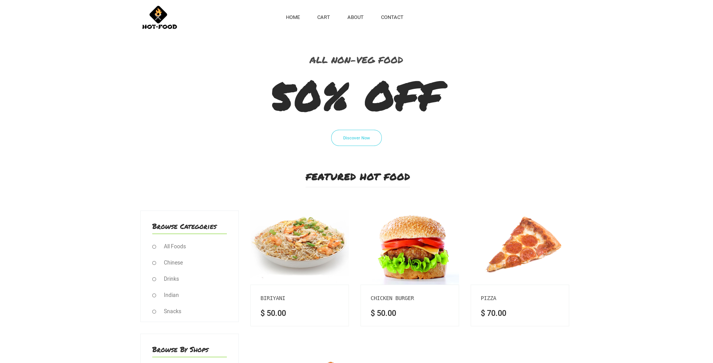
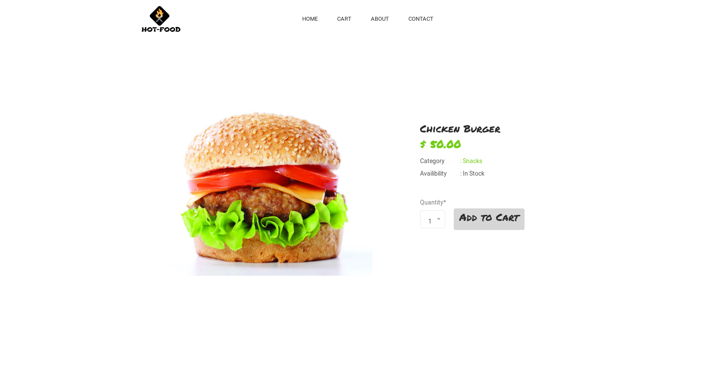

# Hot-Food
> Food Delivery Website built with Django and Bootstrap
# Demo:
## Homepage

## Product page

## Installation:
**1.Clone the Repo**

```
**2.Setup pipenv & Install Requirements**
```sh
pip install pipenv
pipenv install -r requirements.txt
pipenv shell
```
**3.Set Up RabbitMQ Server**
```sh
sudo apt-get install rabbitmq-server
service rabbitmq-server start
```
**4.Migrate Database**
```sh
python manage.py makemigrations
python manage.py migrate
```
**5.Start Server**
```sh
python manage.py runserver
```

